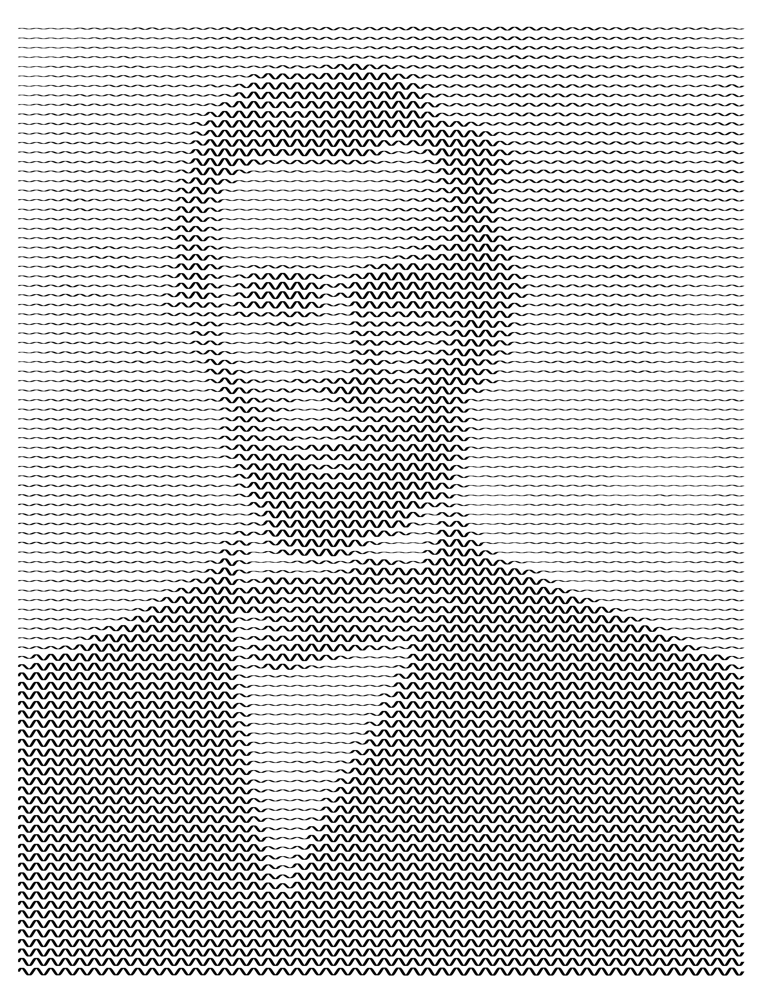

# SineArt

Inspired by Reddit user [/u/tfoust10](https://www.reddit.com/user/tfoust10)'s [amazing artwork](https://www.reddit.com/r/pics/comments/slh2zg/experimenting_with_new_methods_to_make_single/). I am absolutely useless with pen and paper, but can do alright with a keyboard.


## Example
Input:

*source: https://upload.wikimedia.org/wikipedia/commons/4/44/Abraham_Lincoln_head_on_shoulders_photo_portrait.jpg*

Output:


## CLI Usage
```txt
sineart 1.1.0
Plots images as sinewave art, inspired by /u/tfoust10's Reddit posts

USAGE:
    sineart [OPTIONS] <INPUT>

ARGS:
    <INPUT>    Source image

OPTIONS:
    -c, --cols <HCELLS>            Number of sine oscillations [default: 50]
    -h, --help                     Print help information
    -o, --output <OUTPUT>          Output image path. Defaults to $INPUT_sine.jpg
    -r, --rows <VCELLS>            Number of rows of sine waves [default: 50]
    -s, --scale <SCALE>            Percentage scaling of image resolution [default: 100]
        --thickness <THICKNESS>    Thickness of line in pixels [default: 6]
        --threshold <THRESHOLD>    Threshold for white values, so sine waves do not end up
                                   completely flat [default: 255]
    -V, --version                  Print version information
```